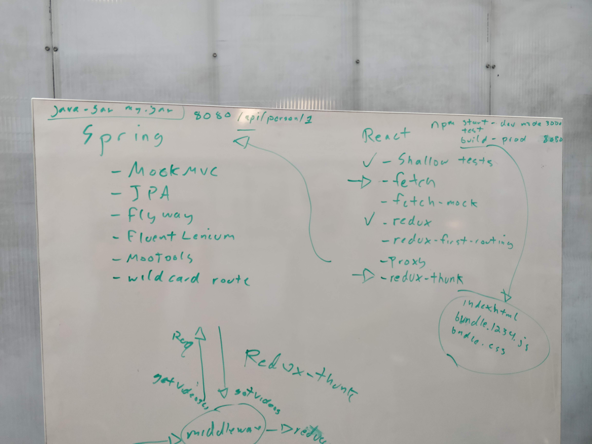
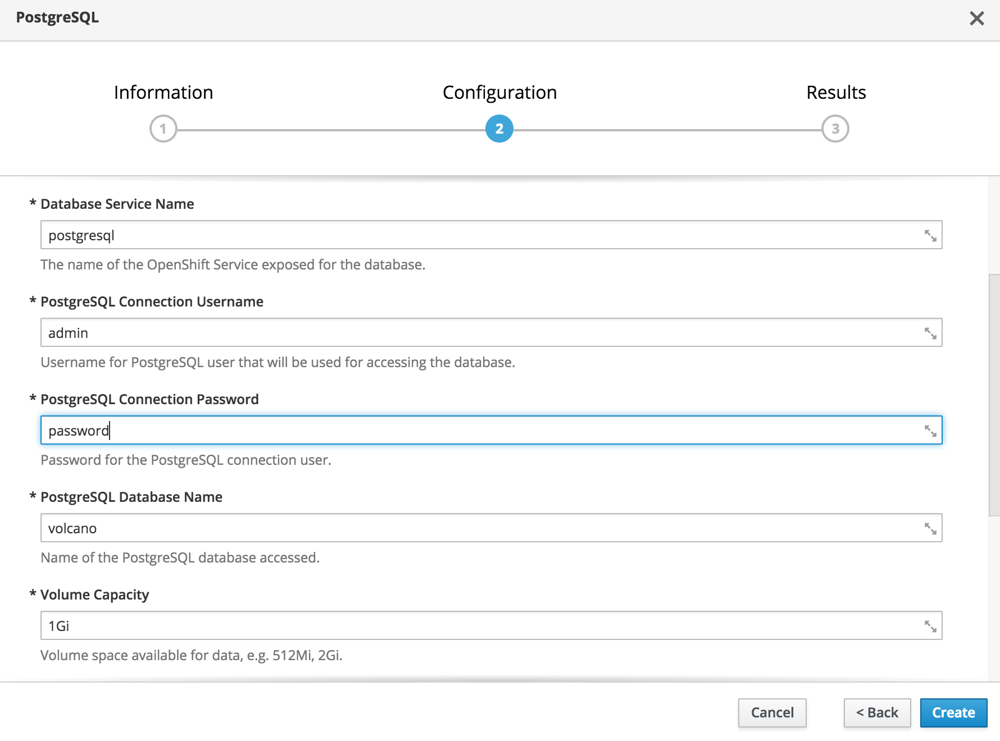
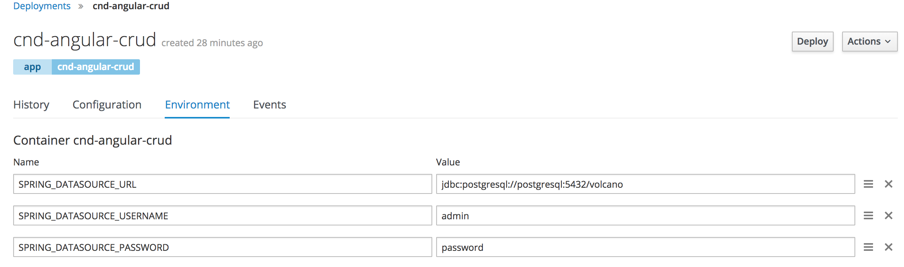
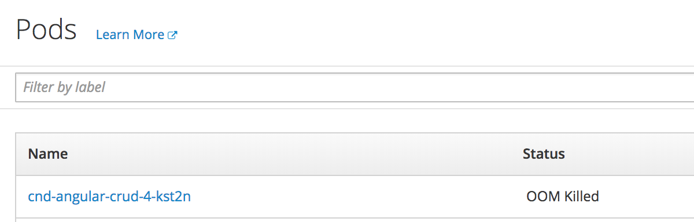
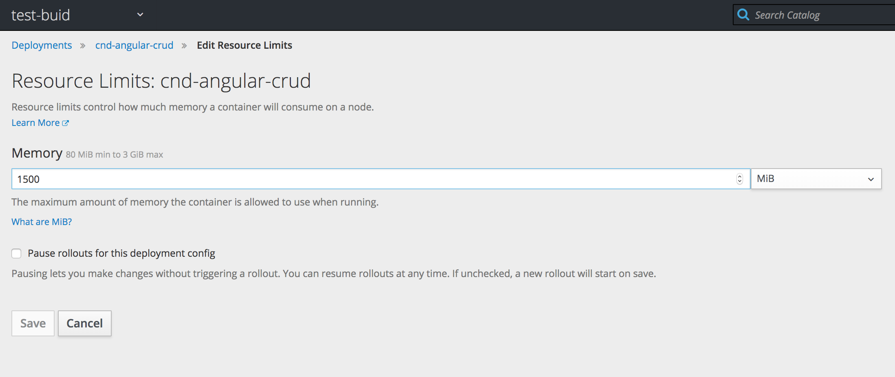

## dev setup (on mac with brew 2018-10-02)

1. `brew cask install chromedriver`
1. `brew install postgresql`
1. `brew services start postgresql`
1. `createdb`
1. `psql -c "create database volcano"`
1. `psql -c "create database volcano_test"`
1. `psql -c "create user postgres with SUPERUSER"`

## Mapping React to Angular

### Angular project setup

1. `npm install -g @angular/cli`
1. `ng new app-name`
1. `cd app-name`
1. `ng serve --open`

The following topics are covered in "standard" CND:



Here is their mapping to Angular:

1. `Jest unit tests` -> [Service testing](https://angular.io/guide/testing#service-tests)
1. `enzyme` -> [Component Testing](https://angular.io/guide/testing#component-dom-testing) 
1. `shallow` -> [Nested Components](https://angular.io/guide/testing#nested-component-testshttps://angular.io/guide/testing#nested-component-tests)
1. `fetch` -> [HttpClient](https://angular.io/guide/http#httpclient)
1. `fetch-mock` -> [HttpClientTestingModule](http://www.syntaxsuccess.com/viewarticle/mocking-http-request-with-httpclient-in-angular)
1. `redux` -> N/A
1. `redux-thunk` -> N/A
1. `redux-first-routing` -> [Angular Router](https://angular.io/guide/router)
1. `proxy` -> [WebPack DevServer Proxy](https://juristr.com/blog/2016/11/configure-proxy-api-angular-cli/)

## Mapping Heroku to OpenShift

Heroku was merely a deployment platform, until they added [Heroku CI](https://devcenter.heroku.com/articles/heroku-ci) and [Heroku Pipelines](https://devcenter.heroku.com/articles/pipelines).

Likewise, OpenShift was merely a deployment platform for docker containers, until they added CI capabilities.

There are 3 ways to build in OpenShift:

- docker (not allowed)
- source (doesn't do gradle)
- pipeline (can build your code, but can't deploy it to OpenShift)

Of these, the `source` build type seems to be most supported. To get it to support gradle, you need to create a custom [source 2 image builder image](https://blog.openshift.com/create-s2i-builder-image/).

We could use an existing s2i builder image for Spring Boot, but since we also want postgres, chrome, and chromedriver installed, we need to make our own.

Source to image is a strange "technology", since it appears to just be a proprietary replacement for [docker add](https://docs.docker.com/engine/reference/builder/#add) `my.jar`.

It would make sense to use the `pipeline` build type instead, except OpenShift runs a Jenkins docker image without docker installed, so Jenkins can build your code, but it can't build a docker image.

The `docker` build type is disabled in OpenShift online, otherwise we could use that.

In the future, it might make sense to create our own Jenkins docker image with docker installed, then we could use a standard CI tool to do a standard docker build.

## OpenShift Gotchas

When working with OpenShift, the most common error encountered will be `OOM killed`, which you can't see in the logs. You need to go under the "pods" menu.

To resolve this error, you need to edit the yaml in various places to up the `memory` part of the `resources` section for your: build, deployment, pod, etc.

See below for one example on how to do this from the command line.

Also, "too many open files" errors will be observed. This doesn't appear to affect anything?

Sometimes OpenShift Online is also just unstable. For example, it just hangs forever while trying to run a build, in which case try again later.

Be aware, a free plan takes a long time to activate, and doesn't come with enough memory to run Spring apps or Gradle builds. You will have to upgrade to pro.

## Deployment

To deploy, run:

```sh
$ oc new-app --strategy=source bgard6977/docker-test~https://github.com/gSchool/cnd-angular-crud
```

And expose:

```sh
oc expose svc/cnd-angular-crud
```

The build will fail due to insufficient memory, so increase memory:

```sh
$ oc patch bc/cnd-angular-crud -p '{"spec":{"resources":{"limits":{"memory":"1500Mi"}}}}'
```

After the build completes, you'll see a connection error to postgres. Create a db:



Then configure the datasource environment variables for your app:



```
SPRING_DATASOURCE_URL
jdbc:postgresql://postgresql:5432/volcano

SPRING_DATASOURCE_USERNAME
admin

SPRING_DATASOURCE_PASSWORD
password
```

Then you can browse to the app, and you should see it crash, because Spring can't serve JSON from a database without gobs of memory:



So crank it up:



## References

- [Proxy](https://juristr.com/blog/2016/11/configure-proxy-api-angular-cli/)
- [More Proxy](https://github.com/angular/angular-cli/blob/master/docs/documentation/stories/proxy.md)
- [Spring Logging](https://www.javadevjournal.com/spring/log-incoming-requests-spring/)
- [OpenShift WebHooks](https://docs.openshift.com/container-platform/3.5/dev_guide/builds/triggering_builds.html)
- [Build environment](https://github.com/bgard6977/docker-test)
- [Karma with ChromeHeadless](https://gist.github.com/wingsuitist/c2c3095b855e9f1054d39df13a317f52)
- [Testing with mock routes](https://stackoverflow.com/questions/39577920/angular-2-unit-testing-components-with-routerlink)
- [Chrome headless with karma](https://cvuorinen.net/2017/05/running-angular-tests-in-headless-chrome/)